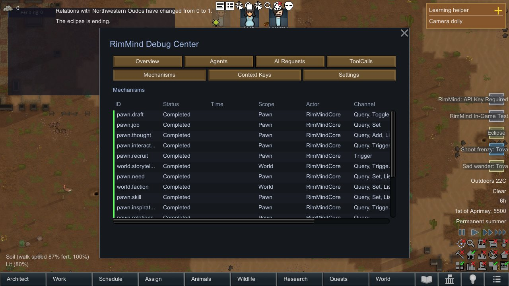
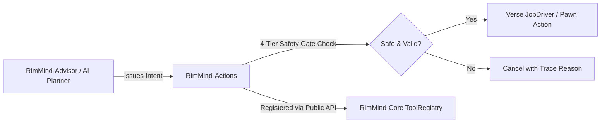

<div align="center">

# RimMind-Actions ⚡
### Composite Mechanisms & Tactical Emergency Actions for RimWorld 1.6

**English** | [简体中文](README_zh.md)

<p>
  <a href="https://rimworldgame.com/"></a>
  <a href="https://github.com/mcocdaa/RimWorld-RimMind-Mod-Core"></a>
  <a href="#"></a>
  <a href="LICENSE"></a>
</p>

<p><em>Equip AI-driven colonists with battlefield triage, life-saving rescue, and tactical autonomy.</em></p>

</div>

---

## 📖 Overview

**RimMind-Actions** translates high-level AI tactical intents into robust, multi-step game actions called **Mechanisms**. When facing sudden crises—such as bleeding out under raid fire or suffocating in a burning room—colonists autonomously execute composite interventions rather than standing idly.

### Key Highlights
- **`StabilizeRestCompositeTool`**: Automatically assesses a wounded ally's bleeding rate, performs rapid field stabilization, carries them to the nearest available medical bed, and orders rest.
- **4-Tier Safety Gate Interceptor**: Evaluates path safety, danger proximity, pawn physical capability, and player priority overrides before issuing Verse jobs.
- **Fire & Refuge Evasion**: Pawns detect explosive radius dangers and pathfind away from infernos to safe designated rally zones.

---

## 🎮 In-Game Showcase


*Battlefield emergency intervention in action: An AI-driven colonist rushes through smoke to bandage a fallen friend and carry them to safety.*

---

## 🏛️ Dependency & Integration

`RimMind-Actions` depends solely on the public API of `RimMind-Core`:



---

## 🛠️ Installation & Requirements

Ensure `RimMind-Core` is loaded before `RimMind-Actions`:

```text
1. Harmony
2. Core (Vanilla RimWorld)
3. RimMind-Core
4. RimMind-Actions
```

---

## 🧪 Developer Guide & Testing

Run unit tests directly:

```powershell
dotnet test RimMind-Actions/Tests/RimMindActions.Tests.csproj -c Release
```

---

## 📜 License

Licensed under the [MIT License](LICENSE).
