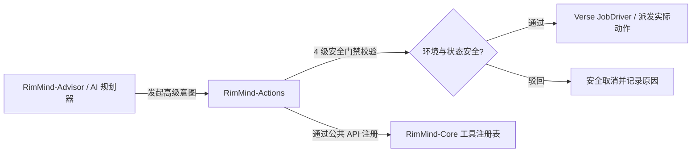

<div align="center">

# RimMind-Actions ⚡
### 专为 RimWorld 1.6 打造的复合机制动作与战地应急自救系统

[English](README.md) | **简体中文**

<p>
  <a href="https://rimworldgame.com/"></a>
  <a href="https://github.com/mcocdaa/RimWorld-RimMind-Mod-Core"></a>
  <a href="#"></a>
  <a href="LICENSE"></a>
</p>

<p><em>为 AI 殖民者赋予战地急救、濒死脱险与自主战术执行能力。</em></p>

</div>

---

## 📖 模块概览

**RimMind-Actions** 负责将大语言模型产生的高级战术意图转化为稳健的多步骤游戏机制动作（**Mechanisms**）。在面临战地重伤失血、致命火灾或虫巢围困等突发险情时，殖民者能够自主发起复合救助，告别原地呆立。

### 核心特性
- **`StabilizeRestCompositeTool` 复合战地急救**：自主评估队友失血速率，火线就地包扎止血，扛起伤员转运至就近医疗床并下达静养指令。
- **4 级安全门禁拦截器**：严格校验路径安全性、危险逼近距离、殖民者身体机能及玩家手动优先级，杜绝自杀式动作。
- **灭火与安全避险**：实时感知爆炸半径与蔓延火势，自主寻找掩体脱离险境。

---

## 🎮 实机特性展示


*战地紧急施救实机场景：AI 殖民者冒着硝烟快速为倒地队友止血，并协作转运至医疗床。*

---

## 🏛️ 依赖关系与设计原则

`RimMind-Actions` 严格单向依赖 `RimMind-Core` 公共 API：



---

## 🛠️ 安装与加载顺序

确保 `RimMind-Core` 位于 `RimMind-Actions` 之前：

```text
1. Harmony
2. Core (RimWorld 原版)
3. RimMind-Core
4. RimMind-Actions
```

---

## 🧪 开发者测试指南

运行单元测试：

```powershell
dotnet test RimMind-Actions/Tests/RimMindActions.Tests.csproj -c Release
```

---

## 📜 开源协议

本项目采用 [MIT License](LICENSE) 开源许可证。
